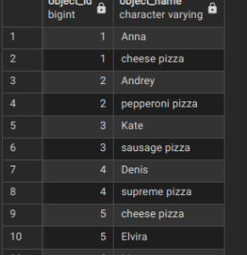
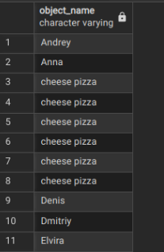
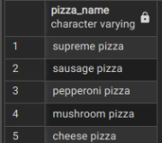
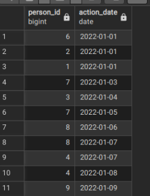
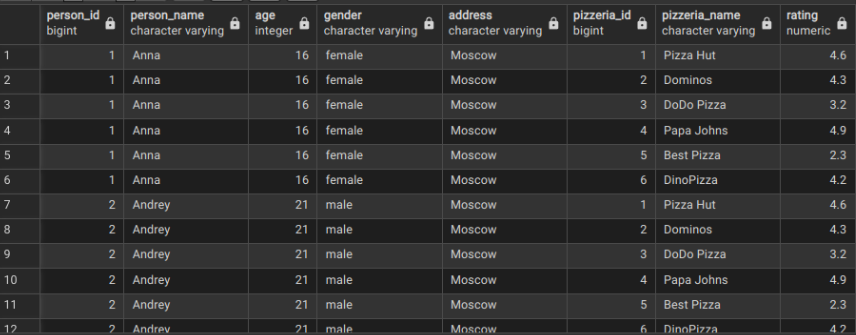
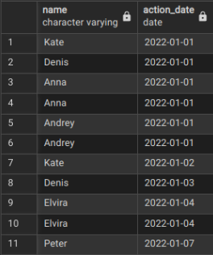
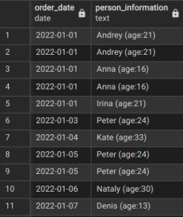
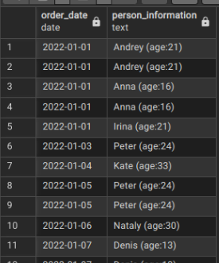
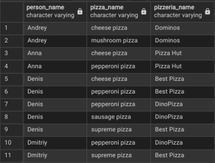

# postgre_days
postgresql coding :3 

## Exercise 00 - Let’s make UNION dance

Please write a SQL statement which returns menu’s identifier and pizza names from menu table and person’s identifier and person name from person table in one global list (with column names as presented on a sample below) ordered by object_id and then by object_name columns.

```sql
SELECT
    menu.id AS object_id,
    menu.pizza_name AS object_name
FROM
    menu
UNION ALL
SELECT
    person.id AS object_id,
    person.name AS object_name
FROM
    person
ORDER BY
    object_id,
    object_name;
```



## Exercise 01 - UNION dance with subquery

Please modify a SQL statement from “exercise 00” by removing the object_id column. Then change ordering by object_name for part of data from the person table and then from menu table (like presented on a sample below). Please save duplicates!

```sql
SELECT
    menu.pizza_name AS object_name
FROM
    menu
UNION ALL
SELECT
    person.name AS object_name
FROM
    person
ORDER BY
    object_name;
```



## Exercise 02 - Duplicates or not duplicates

Please write a SQL statement which returns unique pizza names from the menu table and orders them by pizza_name column in descending mode. Please pay attention to the Denied section.

```sql
SELECT pizza_name
FROM (
    SELECT pizza_name, ROW_NUMBER() OVER (PARTITION BY pizza_name ORDER BY pizza_name) as rn
    FROM menu
) ranked_pizzas
WHERE rn = 1
ORDER BY pizza_name DESC;
```



## Exercise 03 - “Hidden” Insights

Please write a SQL statement which returns common rows for attributes order_date, person_id from person_order table from one side and visit_date, person_id from person_visits table from the other side (please see a sample below). In other words, let’s find identifiers of persons, who visited and ordered some pizza on the same day. Actually, please add ordering by action_date in ascending mode and then by person_id in descending mode.

```sql
SELECT person_id, order_date AS action_date
FROM person_order

INTERSECT

SELECT person_id, visit_date AS action_date
FROM person_visits

ORDER BY action_date ASC, person_id DESC;
```



##  Exercise 04 - Difference? Yep, let's find the difference between multisets.

Please write a SQL statement which returns a difference (minus) of person_id column values with saving duplicates between person_order table and person_visits table for order_date and visit_date are for 7th of January of 2022

```sql
SELECT
  person_id
FROM
  person_order
WHERE
  order_date = '2022-01-07'
  AND person_id NOT IN (
    SELECT
      person_id
    FROM
      person_visits
    WHERE
      visit_date = '2022-01-07'
  );
```


## Exercise 05 - Did you hear about Cartesian Product?

Please write a SQL statement which returns all possible combinations between person and pizzeria tables and please set ordering by person identifier and then by pizzeria identifier columns. Please take a look at the result sample below. Please be aware column's names can be different for you.

```sql
SELECT
    p.id AS person_id,
    p.name AS person_name,
    p.age,
    p.gender,
    p.address,
    pi.id AS pizzeria_id,
    pi.name AS pizzeria_name,
    pi.rating
FROM
    person p
CROSS JOIN
    pizzeria pi
ORDER BY
    p.id,
    pi.id;
```



## Exercise 06 - Lets see on “Hidden” Insights

Let's return our mind back to exercise #03 and change our SQL statement to return person names instead of person identifiers and change ordering by action_date in ascending mode and then by person_name in descending mode. Please take a look at a data sample below.

```sql
SELECT
    p.name,
    po.order_date AS action_date
FROM
    person p
JOIN
    person_order po ON p.id = po.id
UNION ALL
SELECT
    p.name,
    pv.visit_date AS action_date
FROM
    person p
JOIN
    person_visits pv ON p.id = pv.id
ORDER BY
    action_date ASC,
    name DESC;
```



## Exercise 07 - Just make a JOIN

Please write a SQL statement which returns the date of order from the person_order table and corresponding person name (name and age are formatted as in the data sample below) which made an order from the person table. Add a sort by both columns in ascending mode.

```sql
SELECT
    po.order_date,
    CONCAT(p.name, ' (age:', p.age, ')') AS person_information
FROM
    person_order po
JOIN
    person p ON po.person_id = p.id
ORDER BY
    po.order_date ASC,
    person_information ASC;
```



## Exercise 08 - Migrate JOIN to NATURAL JOIN

Please rewrite a SQL statement from exercise #07 by using NATURAL JOIN construction. The result must be the same like for exercise #07.

``` sql
SELECT
    order_date,
    CONCAT(name, ' (age:', age, ')') AS person_information
FROM
    person_order NATURAL JOIN (
    SELECT id AS person_id, name, age
 FROM person
  )
 AS id
 ORDER BY
 order_date ASC,
 person_information ASC;
```



## Exercise 09 - IN versus EXISTS

Please write 2 SQL statements which return a list of pizzerias names which have not been visited by persons by using IN for 1st one and EXISTS for the 2nd one.

``` sql
SELECT name
FROM pizzeria
WHERE id NOT IN (
    SELECT DISTINCT pizzeria_id
    FROM person_visits
);
```


## Exercise 10 - Global JOIN

Please write a SQL statement which returns a list of the person names which made an order for pizza in the corresponding pizzeria. The sample result (with named columns) is provided below and yes ... please make ordering by 3 columns (person_name, pizza_name, pizzeria_name) in ascending mode.

```sql
SELECT
  person.name AS person_name,
  menu.pizza_name,
  pizzeria.name AS pizzeria_name
FROM
  person
  JOIN person_order ON person.id = person_order.person_id
  JOIN menu ON person_order.menu_id = menu.id
  JOIN pizzeria ON menu.pizzeria_id = pizzeria.id
ORDER BY
  person_name ASC,
  menu.pizza_name ASC,
  pizzeria_name ASC;
```

