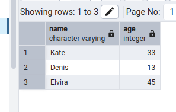
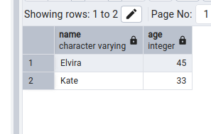
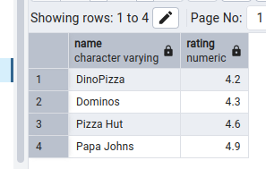
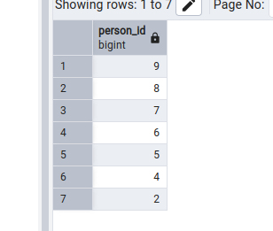
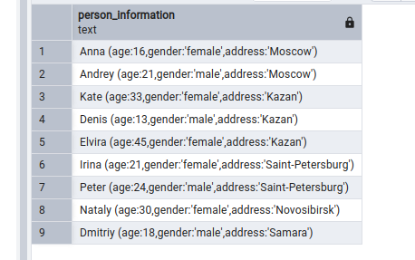
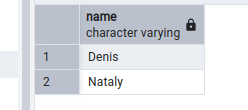
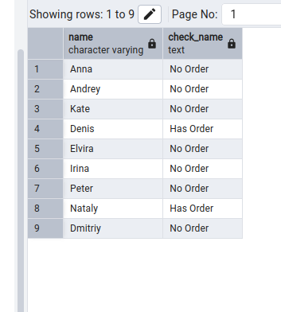
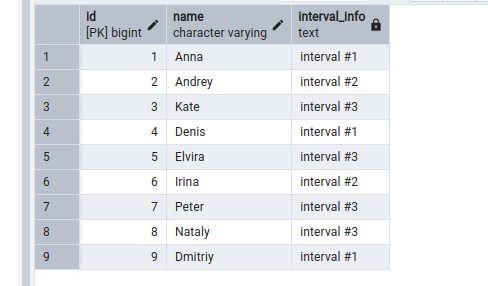
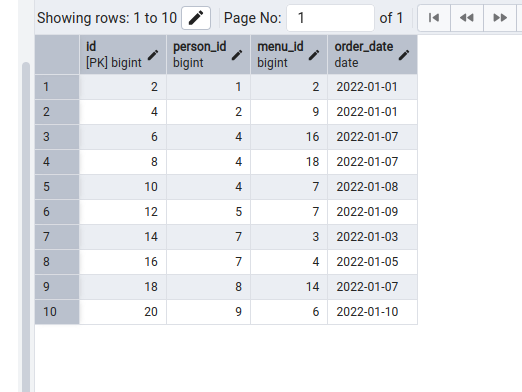
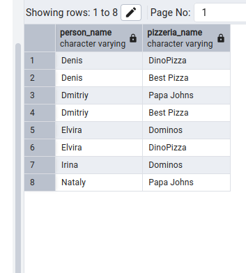

# postgre_days
postgresql coding :3 

## Exercise 00 - First steps into SQL world.

Let’s make our first task. Please make a select statement which returns all person's names and person's ages from the city ‘Kazan’.

```sql
SELECT 
  name, 
  age 
FROM 
  person 
WHERE 
  address = 'Kazan';
```


## Exercise 01 - First steps into SQL world

Please make a select statement which returns names , ages for all women from the city ‘Kazan’. Yep, and please sort result by name.

```sql
SELECT 
  name, 
  age 
FROM 
  person 
WHERE 
  gender = 'female' 
  AND address = 'Kazan' 
ORDER BY 
  name;
```



## Exercise 02 - First steps into SQL world

Please make 2 syntax different select statements which return a list of pizzerias (pizzeria name and rating) with rating between 3.5 and 5 points (including limit points) and ordered by pizzeria rating.

1-st 

``` sql
SELECT 
  name, 
  rating 
FROM 
  pizzeria 
WHERE 
  rating >= 3.5 
  AND rating <= 5 
ORDER BY 
  rating;
```

2-nd

```sql
SELECT 
  name, 
  rating 
FROM 
  pizzeria 
WHERE 
  rating BETWEEN 3.5 
  AND 5 
ORDER BY 
  rating;
```



## Exercise 03 - First steps into SQL world

Please make a select statement which returns the person's identifiers (without duplication) who visited pizzerias in a period from 6th of January 2022 to 9th of January 2022 (including all days) or visited pizzeria with identifier 2. Also include ordering clause by person identifier in descending mode.

```sql
SELECT 
  DISTINCT person_id 
FROM 
  person_visits 
WHERE 
  (
    visit_date BETWEEN '2022-01-06' 
    AND '2022-01-09'
  ) 
  OR pizzeria_id = 2 
ORDER BY 
  person_id DESC;
```



## Exercise 04 - First steps into SQL world

Please make a select statement which returns one calculated field with name ‘person_information’ in one string like described in the next sample:

Anna (age:16,gender:'female',address:'Moscow')

Finally, please add the ordering clause by calculated column in ascending mode. Please pay attention to quote symbols in your formula!

```sql
SELECT 
  CONCAT(
    name, ' (age:', age, ',gender:''', 
    gender, ''',address:''', address, 
    ''')'
  ) AS person_information 
FROM 
  person 
ORDER BY 
  person ASC;
  ```

  

## Exercise 05 - First steps into SQL world

Please make a select statement which returns person's names (based on internal query in SELECT clause) who made orders for the menu with identifiers 13 , 14 and 18 and date of orders should be equal 7th of January 2022. Be aware with "Denied Section" before your work.

```sql
SELECT 
  name 
FROM 
  person 
WHERE 
  id IN (
    SELECT 
      person_id 
    FROM 
      person_order 
    WHERE 
      menu_id IN (13, 14, 18) 
      AND order_date = '2022-01-07'
  );
```



## Exercise 06 - First steps into SQL world

Please use SQL construction from Exercise 05 and add a new calculated column (use column's name ‘check_name’) with a check statement (a pseudo code for this check is presented below) in the SELECT clause.

```sql
SELECT 
  name, 
  CASE WHEN EXISTS (
    SELECT 
      1 
    FROM 
      person_order 
    WHERE 
      person_order.person_id = person.id 
      AND menu_id IN (13, 14, 18) 
      AND order_date = '2022-01-07'
  ) THEN 'Has Order' ELSE 'No Order' END AS check_name 
FROM 
  person
```


## Exercise 07 - First steps into SQL world

Let’s apply data intervals for the person table. Please make a SQL statement which returns a person's identifiers, person's names and interval of person’s ages 

```sql
SELECT 
    id,
    name,
    CASE 
        WHEN age >= 10 AND age <= 20 THEN 'interval #1'
        WHEN age > 20 AND age < 24 THEN 'interval #2'
        ELSE 'interval #3'
    END AS interval_info
FROM 
    person;
```



## Exercise 08 - First steps into SQL world

Please make a SQL statement which returns all columns from the person_order table with rows whose identifier is an even number. The result have to order by returned identifier.

```sql
SELECT *
FROM person_order
WHERE id % 2 = 0
ORDER BY id;
```



## Exercise 09 - First steps into SQL world

Please make a select statement that returns person names and pizzeria names based on the person_visits table with date of visit in a period from 07th of January to 09th of January 2022 (including all days) (based on internal query in FROM clause) .

```sql
SELECT 
    (SELECT name FROM person WHERE id = pv.person_id) AS person_name,
    (SELECT name FROM pizzeria WHERE id = pv.pizzeria_id) AS pizzeria_name
FROM 
    (SELECT person_id, pizzeria_id 
     FROM person_visits 
     WHERE visit_date BETWEEN '2022-01-07' AND '2022-01-09') AS pv
ORDER BY 
    person_name ASC,
    pizzeria_name DESC;
```


